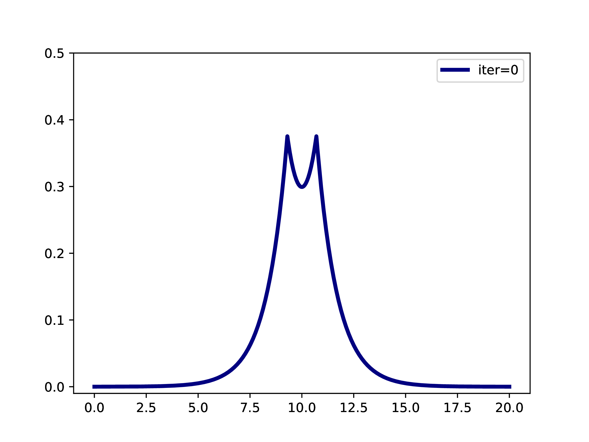
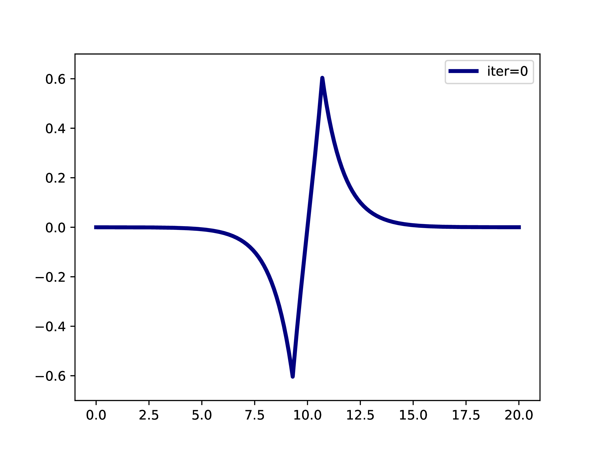
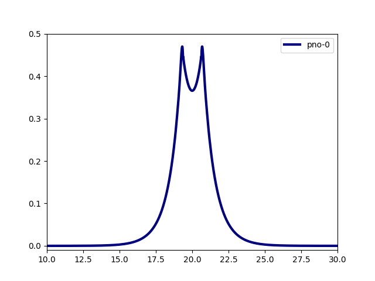
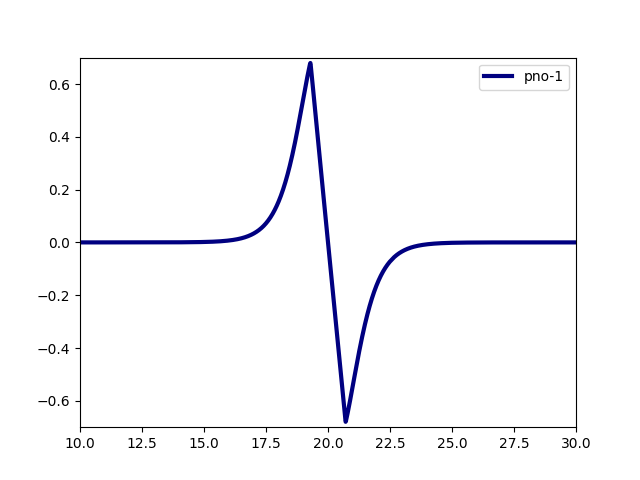
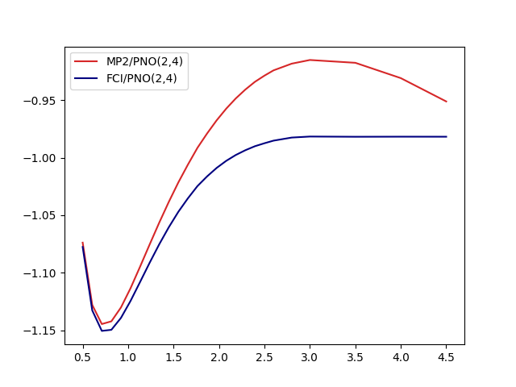
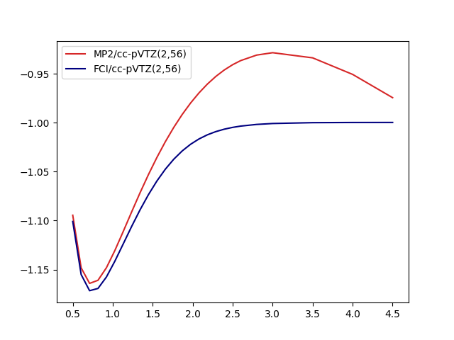

In the following we will see how to compute pair-natural orbitals (PNOs) at the basis set limit and
use them to construct second-quantized Hamiltonians whose eigenstates can be approximated with the usual machinery.

Note that we will not use MP2-F12 (which as used in the original description) but plain MP2 to determine the PNOs.


## Relevant Literature
- [Original description](https://doi.org/10.1063/1.5141880) of directly determined PNOs.
- [Application](https://doi.org/10.1021/acs.jpclett.0c03410) in the context of this tutorial.
- [Diagonal Approximation](https://doi.org/10.1103/PhysRevA.105.032449) used as a default in `FrayedEnds`

# Directly Determined PNOs in a Nutshell

The usual procedure for using pair-natural orbitals is  

1. Solve Hartree-Fock in the given basis set (Roothaan Hall). 
2. Solve MP2 in the given basis set (using the virtual orbitals from the Roothaan Hall procedure). 
3. Compute PNOs from MP2 amplitudes. 
4. Continue with the PNOs in some way. 

A typical example is: A subset of PNOs is selected and orthogonalized. Further many-body methods continue with these orbitals.
This workflow is however only realizable if one works in a fixed set of finite basis functions.
The main difference when working with adaptive multiwavelets is that we are loosely speaking working
within a infinite $L^2$ basis.
As an example: The Hartree-Fock equations in closed-shell formulation form look like
$$ \left(-\frac{\Delta}{2} + V + 2J - 2K\right)\phi_k = \epsilon_k \phi_k $$
with the usual definition of Hartree potential $J$ and exchange operator $K$ that explicitly depend on the
occupied orbitals $\phi_k$ ($k \in \left\{1,2,\dots,N_e/2\right\}$ with $N_e$ being the number of electrons in the system.
For the hydrogen molecule with hydrogen atoms at positions $R$ and $L$, we have the external potential $$ V(x) = \frac{-1}{\lvert R -x\rvert} + \frac{-1}{\lvert L-x \rvert} $$ and $N_e=2$. We can solve for the occupied Hartree-Fock orbital $\phi$, by rearranging the equation above
$$ \phi = -2\int G_\mu \left(V + 2K-J\right)\phi \operatorname{d}x  $$
where $G_\mu$ is the Green's function for the bound state Helmholtz operator $-{\Delta} - \mu$ and $\mu=-\sqrt{-2\epsilon}$. The equation can now be solved iteratively starting from an initial guess. The gif below illustrates the convergence from a guess that resembles the linear combination of two 1s orbitals.

<center>
{width=400}
</center>

Already for this simple system, we can however not solve for virtual orbitals, as they are not bounded in the Hartree-Fock world. Trying to solve will result in a vanishing function that at some point will not be normalizable. Below, this is illustrated with an additional gif.
<center>
{width=400}
</center>

Virtual orbitals do exist in finite basis sets, as the basis is forcing them to be compact. Once we switch into an adaptive representation the orbitals will become more and more diffuse. For that reason, the typical route of using virtual orbitals to construct an expanded tensor-product basis for many-body wavefunctions is not a viable option here. 
PNOs are one way to directly determine virtual (as in "orthogonal to the occupied Hartree-Fock space") orbitals. 

1. Solve HartreeFock at the basis set limit (see [Harrison et. al.](https://doi.org/10.1063/1.1791051); only occupied orbitals)
   Leading to $\left\{\phi_k\right\}_{k=1}^{N_e/2}$ orbitals
2. Chose Localization (Default: Foster-Boys)

Pair natural orbitals are one way to compute a relatively cheap set of orbitals beyond the occupied Hartree-Fock space.
We refer to [the original description](https://doi.org/10.1063/1.5141880) for further details and just sketch the general structure.
For each pair of Hartree-Fock orbitals $\phi_i, \phi_j$ we can compute a set of PNOs
$$ \left\{\varphi^{ij}_k\right\}_{k=1}^{r_{ij}} $$
where $r_{ij}$ are the pair ranks (a value the user can set). We usually pick a global rank $R$ (keyword=`maxrank`) $r_{ij}=R$.
If no global rank is selected the PNOs are truncated based on their occupation numbers $d^{ij}_k$. 
The `FrayedEnds` default is using the diagonal approximation, which only computes PNOs with $i=j$.

3. Initial guess on PNOs
4. Compute MP2 amplitudes within the current set
5. Refine PNOs (similar fixed-point equation as Hartree-Fock above, see the original descirption for the explicit potentials)
6. Repeat 4/5 until convergence
7. If necessary (depends on `maxrank`) back to 3

At the end of the procedure we have the following orbital sets:
$$ \left\{\varphi^{i}_{k} \right\}_{k=1}^{R} $$ 
where we labelled the occupied HF orbital $\phi_{i} \equiv \varphi^i_{0}$ as the PNO with index 0.

The PNOs are naturally orthogonal to the HF orbitals, and among their corresponding pairs
$$ \langle \varphi^{i}_a \vert \varphi^{i}_b \rangle = \delta_{ab}, \;\;\; \langle \varphi^{i}_0 \vert \varphi^{j}_0 \rangle = \delta_{ij}$$ 
To use them as one-body basis, they have to be orthogonalized. The default procedure is the symmetric orthogonalization, but in some cases cholesky orthoginalization (when PNOs are sorted by their occupation numbers) can be beneficial.

# Construct PNOs

As an initial example we will use the Hydrogen molecule. Note that this system has $N_e=2$ electrons and therefore only a single occupied Hartree-Fock orbital and correspondingly only a single set of PNOs, meaning all our orbitals are already orthogonal. 

```python
import frayedends as fe

world = frayedends.MadWorld3D()

coord = "H 0.0 0.0 0.0\nH 0.0 0.0 0.75"
units = "angstrom"

madpno = frayedends.MadPNO(world, coord, units=units, n_orbitals=2)

# get the raw PNOs
pnos = madpno.get_orbitals()
```

We can now compute the typical integrals $h^k_l, g^{kl}_{mn}$ that define the second quantized Hamiltonian
$$ H = \sum_{kl}\sum_{\sigma\in\left\{\uparrow,\downarrow\right\}} h^k_l a^\dagger_{k_\sigma} a_{l_\sigma} + \frac{1}{2}\sum_{\sigma,\gamma\in\left\{\uparrow, \downarrow\right\}}\sum_{klmn} g^{kl}_{mn} a_{k_{\sigma}}^\dagger a_{l_{\gamma}}^\dagger a_{n_\gamma} a_{m_{\sigma}} $$

with 
$$
h = \langle \varphi_k \rvert T + V \lvert \varphi_l \rangle,\;\; g^{kl}_{mn} = \langle \varphi_k \varphi_l \rvert \frac{1}{|x_1-x_2|} \lvert\varphi_m\varphi_n \rangle 
$$

```python
# nuclear repulsion constant
c = madpno.get_nuclear_repulsion()
# get the nuclear potential
Vnuc = madpno.get_nuclear_potential()
# compute integrals
integrals = frayedends.Integrals3D(world)
g = integrals.compute_two_body_integrals(orbitals)
T = integrals.compute_kinetic_integrals(orbitals)
V = integrals.compute_potential_integrals(orbitals, Vnuc)
h = T + V
S = integrals.compute_overlap_integrals(orbitals)
```

We can plot the integrals either as cube files (see other tutorials) or chose a straight line that we want to investigate.
```python
world.line_plot(mra_function=orbitals[0], filename="h2_0.data")
world.line_plot(mra_function=orbitals[1], filename="h2_1.data")
```

<center>
{width=400}
{width=400}
</center>

## H2 Dissociation

In the following we illustrate a small workflow that computes the dissociation of the molecule
1. Compute PNO basis (start with 2 orbitals)
2. Orthonormalize PNOs (to avoiding copy/paste and agent errors for other systems with more than 2 electrons)
3. Compute integrals
4. Transfer to PySCF
5. Compute FCI and MP2 energies
7. Repeat with more PNOs
8. Compare to classical cc-pVXZ series

We first compute a minimal size basis, for H$_2$ this means two spatial orbitals.
```
import frayedends as fe
import numpy

world = fe.MadWorld3D()

# change this to compute more orbitals
n_orbitals = 2
coord = "H 0.0 0.0 -{R}\nH 0.0 0.0 {R}"
units = "angstrom"

points = list(numpy.linspace(0.5,2.5,20)) + [2.6,2.8,3.0,3.5,4.0,4.5]
mp2 = []
fci = []

for R in points:
    madpno = fe.MadPNO(world, coord.format(R=R/2), units=units, n_orbitals=n_orbitals)

    # get the raw PNOs
    pnos = madpno.get_orbitals()
    # nuclear repulsion constant
    c = madpno.get_nuclear_repulsion()

    # get the nuclear potential
    Vnuc = madpno.get_nuclear_potential()
    # compute integrals
    integrals = fe.Integrals3D(world)
    orbitals = integrals.orthonormalize(pnos)
    G = integrals.compute_two_body_integrals(orbitals)
    T = integrals.compute_kinetic_integrals(orbitals)
    V = integrals.compute_potential_integrals(orbitals, Vnuc)

    mol = fe.PySCFInterface(geometry=coord.format(R=R/2), one_body_integrals=T + V, two_body_integrals=G, constant_term=c)
    mp2 += [mol.compute_energy("mp2")]
    fci += [mol.compute_energy("fci")]

```

The results look like

<center>
{width=400}
</center>

where we used the notation method/basis(number of electrons, number of spin orbitals) following previous literature.
In comparisson we can take a look at the results using the cc-pVTZ basis set (28 orbitals)
<center>
{width=400}
</center>

One key observation here is that even though MP2 is neither qualitatively not quantitatively suitable for the whole dissociation curve, the MP2-based PNOs don't seem to inherit that property. On a closer look, some effects are however inherited by the basis: The dissocation limit for FCI(2,4) is not converging towards the correct result:

- Two isolated hydrogen atoms have -1.0 energy in atomic units. Two orbitals suffice to represent this!
- FCI/PNO(2,4) is converging towards -0.981
- FCI/cc-pVTZ(2,56) is basically there -0.996
- More PNOs allow the system to relax: FCI/PNO(2,8)=0.995.

For more qualitative and quantitative benchmarks we refer to [this](https://doi.org/10.1103/PhysRevA.105.032449) and [this](https://arxiv.org/abs/2410.19116) article. 

